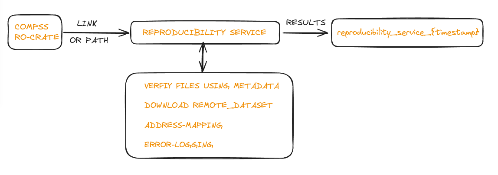

## Introduction
Hello everyone
I'am Archit from India. An undergraduate student at the Indian Institute of Technology, Banaras Hindu University, IIT (BHU), Varanasi. As part of the [Automatic reproducibility of COMPSs experiments through the integration of RO-Crate in Chameleon](https://ucsc-ospo.github.io/project/osre24/bsc/ro-crate-compss/) my proposal [proposal](https://drive.google.com/file/d/1qY-uipQZPox144LD4bs05rn3islfcjky/view) under mentorship of {} aims to develop a service that facilitates the automated replication of COMPSs experiments within the Chameleon infrastructure.

## About the project:

The project proposes to create a service that will have the capability to take a COMPSs crate (an artifact adhering to the RO-Crate specification) and, through analysis of the provided metadata construct a Chameleon-compatible image for replicating the experiment on the testbed. Minor adjustments to the COMPSs RO-Crate are anticipated, such as incorporating  third- party software necessary for the application.

## Progress

It has been more than six weeks since the ReproducibilityService project began, and significant progress has been made. You can test the actual service from my GitHub repository: [ReproducibilityService](https://github.com/Minimega12121/COMPSs-Reproducibility-Service). Let's break down what the ReproducibilityService is capable of doing now:

1. **Support for Reproducing Basic COMPSs Experiments**: The RS program is now fully capable of reproducing basic COMPSs experiments with no third-party dependencies on any device with the COMPSs Runtime installed. Here's how it works:

   - **Getting the Crate**: The RS program can accept the COMPSs workflow from the user either as a path to the crate or as a link from WorkflowHub. In either case, it creates a sub-directory for further execution named `reproducibility_service_{timestamp}` and stores the workflow as `reproducibility_service_{timestamp}/Workflow`.

   - **Address Mapping**: The ro-crate contains `compss_submission_command_line.txt`, which is the command originally used to execute the experiment. This command may include many paths such as `runcompss flag1 flag2 ... flagn <main_workflow_file.py> input1 input2 ... inputn output`. The RS program maps all the paths for `<main_workflow_file.py> input1 input2 ... inputn output` to paths inside the machine where we want to reproduce the experiment. The flags are dropped as they may be device-specific, and the service asks the user for any new flags they want to add to the COMPSs runtime.

   - **Verifying Files**: Before reproducing an experiment, it's crucial to check whether the inputs or outputs have been tampered with. The RS program cross-verifies the `contentSize` from the `ro-crate-metadata.json` and generates warnings in case of any abnormalities.

   - **Error Logging**: In case of any problems during execution, the `std_out` and `std_err` are stored inside `reproducibility_service_{timestamp}/log`.

   - **Results**: If any results do get generated by the experiment, the RS program stores them inside `reproducibility_service_{timestamp}/Results`. If we
   ask for the provenance of the workflow also, the ro-crate thus generated is also stored here only.

2. **Support for Reproducing Remote Datasets**: If a remote dataset is specified inside the metadata file, the RS program fetches the dataset from the specified link using `wget`, stores the remote dataset inside the crate, and updates the path in the new command line it generates.

## Challenges and End-Term Goals

- **Support for DATA_PERSISTENCE_FALSE**: The RS program still needs to support crates with `dataPersistence` set to false. After weeks of brainstorming ideas on how to implement this, we recently concluded that since the majority of `DATA_PERSISTENCE_FALSE` crates are run on SLURM clusters, and the dataset required to fetch in such a case is somewhere inside the cluster, the RS program will support this case for such clusters. Currently, I am working with the Nord3v2 cluster to further enhance the functionality of ReproducibilityService.

- **Chameleon Cluster Setup**: I have made some progress towards creating a new COMPSs 3.3 Appliance on Chameleon to test the service. However, creating the cluster setup script needed for the service to run on a COMPSs 3.3.1 cluster to execute large experiments has been challenging.

- **Integrating with COMPSs Repository**: After completing the support for `dataPersistence` false cases, we aim to launch this service as a tool inside the [COMPSs repository](https://github.com/bsc-wdc/compss). This will be a significant milestone in my developer journey as it will be the first real-world project I have worked on, and I hope everything goes smoothly.

Stay tuned for the next blog!!

